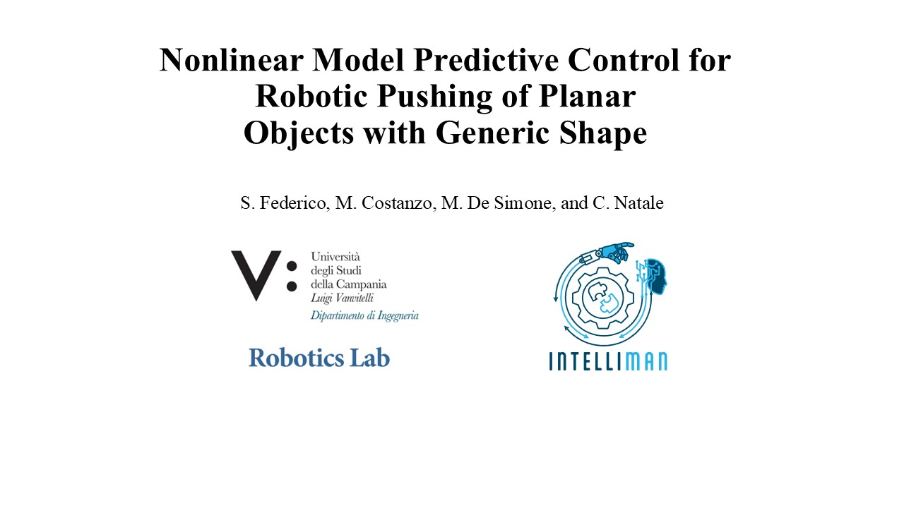

[](https://www.gnu.org/licenses/gpl-3.0)

# Nonlinear Model Predictive Control for Robotic Pushing of Planar Objects with Generic Shape
This workspace is designed to simulate and control through a Nonlinear Model Predictive Control (NMPC) the pusher-slider system modeled under the quasi-static assumption. The NMPC, set up to perform the _pushing_ manouvre of planar objects with generic shape, has been implemented through [acados](https://docs.acados.org/) in the Matlab environment. Have a look at the attached video!

[](https://www.youtube.com/watch?v=d6VJz0RBUEw)


## Content
- [Installaion](#installation)
- [Usage](#usage)
- [Organization](#organization)

## Installation
⚠️ **Software compatibility:** the code has been tested on **MATLAB2022b** (and **later**), both on Linux and Windows. If you use an older Matlab version, you should be not able to use some extra functions of the code, since they require toolbox not available in previous Matlab versions; in this case, just comment out them and you will able to run the simulation anyway.  

1. **Install requiriments:**  
   First, follow the instructions on the acados [installation page](https://docs.acados.org/installation/index.html) to install it. The code has been tested with the acados version **v.0.2.1**.
   Moreover, the **Navigation Toolbox** of Matlab is required to see the animations.  
  
3. **Clone the repository:**
   ```sh
   git clone https://github.com/sara9915/uclv_qs_pushing_matlab.git

## Organization
The code is implementend through the object-oriented programming approach. The key components of the workspace are the following.

- **`acados_nmpc/main.m`**  
  This is the main script. It sets up the environment, configures the model by selecting an object from the provided database, creates a PusherSliderModel object and initializes it depending on the configured parameters.

- **`acados_nmpc/PusherSliderModel.m`**  
  This class implements the dynamic that describes the pusher-slider system under the quasi-static assumption. Both symbolic functions (under casadi) and numerical ones are implemented to evaluate the dynamic for a given iput. Given a ply, it reconstructs the spline representing the shape of the object by using an object _bspline_shape_. 

- **`cad_models/`**  
  This folder contains CAD models of different objects that the pusher might interact with.

- **`acados_nmpc/objects_database/`**  
  This folder contains a function to select the physical parameters corresponding to the selected slider.  

## Usage
1. **Setup acados**  
Ensure that the environment variables for acados are correctly set up. For Windows, this is handled in the file acados_nmpc/env_vars_acados.m.

3. **Run the main script**  
After setting all the plant and the controller parameters, just execute main.m in MATLAB to start the simulation.

## How to cite 

If you use this software in a research project, please cite as follows:
```
@ARTICLE{10873858,
  author={Federico, Sara and Costanzo, Marco and De Simone, Marco and Natale, Ciro},
  journal={IEEE Robotics and Automation Letters}, 
  title={Nonlinear Model Predictive Control for Robotic Pushing of Planar Objects with Generic Shape}, 
  year={2025},
  volume={},
  number={},
  pages={1-8},
  keywords={Robots;Shape;Splines (mathematics);Vectors;Computational modeling;Analytical models;Trajectory;Nonlinear dynamical systems;Training;Robot kinematics;Contact Modeling;Dexterous Manipulation;Optimization and Optimal Control},
  doi={10.1109/LRA.2025.3539092}}


```

